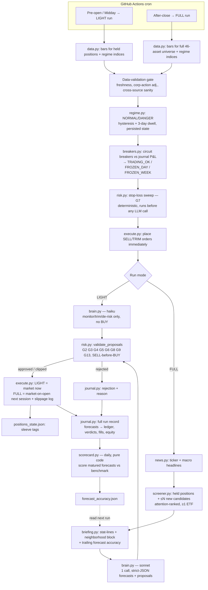

# v1 Architecture Proposal — screener → brain → risk gate

Based on `prd-v1.md` and build-guide §1–§4, checked against the actual current
state of `bot/` (still v0: caps live inline in `execute.py`, sleeves are
CORE/TACTICAL/HEDGE, no `screener.py`/`brain.py`/`risk.py`/`news.py` yet).

---

## 1. Diagram

---

## 2. File plan

**New modules**

| File | Owns |
|---|---|
| `bot/news.py` | `get_ticker_headlines`, `get_macro_headlines` — Alpaca NewsClient, dedup, title-only caps (T5). |
| `bot/regime.py` | Stateful regime classification (NORMAL/DANGER) with hysteresis + 3-day dwell. Reads indicator panel from `signals.py`, persists dwell timers to `logs/regime_state.json`. Separate from `signals.py` because it's stateful and PRD-tunable (thresholds), while `signals.py` stays pure stateless math. |
| `bot/screener.py` | `select_candidates()` — deterministic ranking, zero LLM cost. |
| `bot/briefing.py` | Compresses bars/indicators/news/neighborhood/position/forecast-accuracy into the ~40-token stat-line format + pipe-table (T1, T4). |
| `bot/brain.py` | One Claude API call per run, model selected by run mode, strict-JSON schema, prompt caching on the static prefix, retry-then-`FALLBACK_HOLD` on malformed output (G10). |
| `bot/risk.py` | Two responsibilities, both deterministic, both "no brain can override": `sweep_stop_losses()` (G7, runs pre-brain) and `validate_proposals()` (G2–G9, G13, runs post-brain). |
| `bot/scorecard.py` | Daily, pure-code job: scores forecasts that matured since the last run against their benchmark, updates `logs/forecast_accuracy.json`. Not in your constraint list, but `briefing.py` has a hard read-dependency on this file's output — see §4.3. |

**Modified**

| File | Change |
|---|---|
| `bot/execute.py` | Strip out cap-checking logic (ticker/sector/position-count) — that policy moves to `risk.py` so there's one source of truth. `execute.py` keeps: notional-vs-shares handling, market-hours check, market-on-open (`opg`) order type for FULL runs, bid/ask + slippage logging. Becomes "how to place an already-approved order," not "should this order happen." See §4.1 — this reverses step 3's original design and is worth confirming with you. |
| `bot/main.py` | Rewired into the two run-mode paths in the diagram; conductor only, no policy. |
| `bot/journal.py` | Extended schema: forecast ledger entries (per horizon, with expiry date), sleeve-tagged trades, token counts by section, sweep events, breaker state. |
| `bot/config.py` | Split in two — see §4.4. Keeps: universe, hard-guardrail constants, model names, cadence. Loses: the parameters the Strategy Brain will need to tune later. |

**New state files**

| File | Written by | Read by |
|---|---|---|
| `logs/positions_state.json` | `execute.py` | `risk.py`, `briefing.py` |
| `logs/regime_state.json` | `regime.py` | `regime.py` (own next run), `risk.py`, `brain.py` |
| `logs/forecast_accuracy.json` | `scorecard.py` | `briefing.py` |
| `logs/tunables.json` *(proposed, see §4.4)* | Strategy Brain (future) | `risk.py`, `brain.py`, `screener.py` |

---

## 3. Data flow

**FULL run (after-close), the long path:**

1. `data.py` fetches 250d bars for all 46 assets + regime indices.
2. **Data-validation gate** (freshness, corporate-action adjustment, sanity bounds) runs immediately on the raw fetch — before screener or brain ever see a symbol. Anything failing is dropped from this run's universe and logged, not silently substituted.
3. `regime.py` classifies NORMAL/DANGER using the indicator panel, applying hysteresis and the 3-day dwell against the persisted state file.
4. `breakers.py` checks circuit breakers against the journal's P&L history.
5. `risk.py.sweep_stop_losses()` compares every open position's unrealized P/L to its sleeve's stop threshold and generates SELL orders unconditionally — no LLM involved, runs even in a frozen or DANGER state.
6. `execute.py` fires those stop-loss SELLs immediately.
7. `news.py` pulls ticker + macro headlines.
8. `screener.py` ranks the remaining universe by attention score and returns held positions + top new candidates (cap discussed in §4.2).
9. `briefing.py` compresses each candidate into a stat-line with its neighborhood block and trailing forecast accuracy, assembles the single pipe-table prompt payload.
10. `brain.py` makes one Claude call (sonnet), gets back strict-JSON forecasts (1w/1m/3m) + sleeve-tagged proposals.
11. `risk.py.validate_proposals()` runs G2→G9→G13 in order, SELLs validated before BUYs (so a swap-at-the-cap works), each proposal approved/clipped/rejected with a logged reason.
12. `execute.py` submits approved orders as market-on-open for the next session, logging the slippage haircut per fill.
13. `journal.py` writes the full run record: every forecast to the ledger (with its expiry date so `scorecard.py` knows when to grade it), every verdict, every fill, resulting equity.
14. `positions_state.json` updated with sleeve tags for anything opened/closed.
15. (Separately, daily) `scorecard.py` scores any forecast whose horizon just expired against its benchmark and updates `forecast_accuracy.json`, which step 9's `briefing.py` reads on the *next* run.

**LIGHT run (pre-open/midday):** steps 1–6 identical, then straight to `brain.py` (haiku) restricted by prompt *and* by `risk.py` (code-enforced, not just prompt-enforced) to monitor/trim/de-risk — no screener, no news pull, no new-position proposals possible even if the model tries.

---

## 4. Where I'm pushing back

### 4.1 Cap-checking logic shouldn't live in two places
Step 3 built `execute.py` on purpose so caps "live inside the hand" — a vending machine that physically can't dispense to a minor regardless of who's asking. That was the right call when `execute.py` was the *only* gate. Now step 12 adds `risk.py` as a dedicated pre-trade gate for LLM proposals. If both files independently check ticker/sector/position caps, they will drift — someone fixes a bounds bug in one and not the other, and the two "vending machines" start disagreeing. I'd rather have one source of truth: `risk.py` owns every "should this happen" decision (G2–G9, G13, the stop sweep), `execute.py` owns only "how do I mechanically place an order that's already been approved" (notional vs. shares, market hours, order type, slippage log). The vending-machine philosophy survives — it just moves up one layer, to the one function everything must pass through before *any* order is placed, whether the order came from the LLM or from the deterministic sweep.

### 4.2 "≤12 candidates" and "10–15 holdings at steady state" contradict each other
Guide §11's screener spec is "≤12 symbols: always include held positions; rank rest by attention score." At steady state (10–15 holdings per PRD §2 and guide §4's own G5 row), held positions alone can exceed 12, leaving zero discovery slots — or breaking the cap outright. Worth noting separately: the guide's own §3 prose says "the portfolio holds ≤8 positions (G5)" while its own §4 table and the PRD both say 10–15 — and the *live* `config.py` still has `max_positions: 8` (untouched since step 6). Three sources, three numbers. Before the screener cap means anything, `max_positions` needs to actually land on 10–15 in code. Given that, I'd propose the cap should really be "≤12 *new* candidates" as a separate, uncapped "always-brief every held position" set — token cost is fine even at 15 held + 12 new (~27 candidates × ~100 tokens ≈ 2,700 tokens, well inside the 8k input budget), and it avoids silently dropping forecast coverage on a holding, which would violate the coverage rule in PRD §5 ("every holding must carry live forecasts at all horizons").

### 4.3 `briefing.py` needs a number nobody's asked for yet
The stat-line spec requires "trailing forecast accuracy... one line per candidate," but no module in the current build plan produces it — PRD §3.3 mentions a "cheap daily scoring job that is pure code" but that's scoped to the Evaluation & Strategy Brain, which per your constraints is out of scope for this pass. I don't think it can actually be deferred that far: `brain.py` can't run in week 3 without *something* answering "what's this brain's track record," even if that something is just a default/empty state in week 1. I've added `bot/scorecard.py` to the file plan for that reason — small, deterministic, no LLM — and it needs a defined empty-state behavior (no forecasts scored yet → briefing shows `fc acc: n/a`) so `brain.py` doesn't choke on day one.

### 4.4 The tunables need to be a data file, not Python constants, starting now
PRD §3.4 requires the Strategy Brain to rewrite bounded parameters (sleeve baselines, regime thresholds, factor weights) without either brain ever touching code. That only works if those parameters live in something a program can safely rewrite — a JSON/YAML file with a version and change log — separate from the hard guardrails that stay as Python constants in `config.py`. The Strategy Brain itself isn't being built in this pass, but if the tunable/hard-guardrail split doesn't exist from the start, `risk.py` and `brain.py` will be written against `config.py` constants, and separating them out later means touching every file that reads `RISK[...]` a second time. I'd rather introduce `logs/tunables.json` now (Strategy Brain writes to it later; `risk.py`/`brain.py`/`screener.py` read from it starting now) even though nothing mutates it yet.

### 4.5 One thing I'm *not* changing, flagged so you can veto it
I put the G7 stop-loss sweep inside `risk.py` alongside `validate_proposals()`, even though it runs at a different point in the cycle (before the brain, not after) and takes no proposals as input. My reasoning: both are "deterministic, no-brain-involved, can't-be-argued-with" rules — same trust boundary, same reason to exist, same reviewer reading the file to convince themselves nothing here is persuadable. The alternative is a dedicated `bot/stops.py`, which more literally mirrors the guide's step-by-step framing ("sweep" as its own pipeline stage). I went with one file because I'd rather a security reviewer (or you, six weeks from now) find every "code says no" rule in one place — but it's a naming choice, not a technical constraint, and I'd take either.

---

## 5. Decision log

**2026-07-23 — v1 architecture approved.**

Weakest-assumption review (see conversation) surfaced the single-vendor data risk on the stop-loss sweep: the data-validation gate cannot actually perform "cross-source consistency" (only one vendor, Alpaca, is wired anywhere in the build), so G7 can act unconditionally on a bad tick with no downstream check, because it's designed to have none.

**Decision: ACCEPT for paper trading, bounded by two mitigations; second price source becomes a live-graduation requirement, not a paper requirement.**

1. **Confirming-quote filter** — `risk.py.sweep_stop_losses()` does not fire a stop on a single breach reading. It re-checks the triggering price (a fresh quote pull, or requiring the breach to hold across the current + prior bar) before submitting the SELL. This is a same-vendor mitigation — it filters transient bad ticks, not a systematically wrong feed — and is a scope addition to the sweep logic described in §3, step 5.
2. **`STOP_ANOMALY` exclusion from forecast stats** — if a stop fires and is later flagged anomalous (price reverted sharply right after, or the confirming-quote filter logged a disagreement it still proceeded past), `scorecard.py` tags that forecast outcome `STOP_ANOMALY` and excludes it from hit-rate/Brier calculations rather than scoring it as a normal stop-out. Keeps a single bad tick from quietly corrupting the forecast-accuracy track record that `briefing.py` reads back into the next run.
3. **Second price source scoped to the sweep only** — not the whole data-validation gate, not the screener or briefing — added to the PRD §9 graduation gate list. Paper trading proceeds on the single-vendor assumption, explicitly accepted rather than silently carried.

Implication for the build: `risk.py`'s sweep function needs the confirming-quote step from day one (step 12/13 of the guide); `scorecard.py` needs the `STOP_ANOMALY` tag in its schema from day one (§4.3 of this doc); PRD §9's graduation checklist should get an explicit line for the second price source before this is truly closed.
