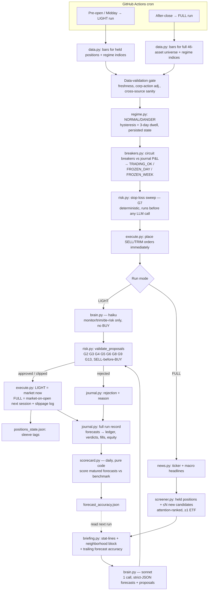

# v1 Architecture Proposal — screener → brain → risk gate

Based on `prd-v1.md` and build-guide §1–§4, checked against the actual current
state of `bot/` (still v0: caps live inline in `execute.py`, sleeves are
CORE/TACTICAL/HEDGE, no `screener.py`/`brain.py`/`risk.py`/`news.py` yet).

---

## 1. Diagram

```mermaid
flowchart TD
    subgraph Trigger["GitHub Actions cron"]
        T1[Pre-open / Midday → LIGHT run]
        T2[After-close → FULL run]
    end

    T1 --> D1[data.py: bars for held positions + regime indices]
    T2 --> D2[data.py: bars for full 46-asset universe + regime indices]

    D1 --> GATE[Data-validation gate\nfreshness, corp-action adj., cross-source sanity]
    D2 --> GATE

    GATE --> REG[regime.py: NORMAL/DANGER\nhysteresis + 3-day dwell, persisted state]
    REG --> BRK[breakers.py: circuit breakers vs journal P&L\n→ TRADING_OK / FROZEN_DAY / FROZEN_WEEK]
    BRK --> SWEEP[risk.py: stop-loss sweep — G7\ndeterministic, runs before any LLM call]
    SWEEP --> EXE1[execute.py: place SELL/TRIM orders immediately]

    EXE1 --> MODE{Run mode}
    MODE -->|LIGHT| BRAINL[brain.py — haiku\nmonitor/trim/de-risk only, no BUY]
    MODE -->|FULL| NEWS[news.py: ticker + macro headlines]
    NEWS --> SCR[screener.py: held positions + ≤N new candidates\nattention-ranked, ≥1 ETF]
    SCR --> BRIEF[briefing.py: stat-lines + neighborhood block\n+ trailing forecast accuracy]
    BRIEF --> BRAINF[brain.py — sonnet\n1 call, strict-JSON forecasts + proposals]

    BRAINL --> RISK[risk.py: validate_proposals\nG2 G3 G4 G5 G6 G8 G9 G13, SELL-before-BUY]
    BRAINF --> RISK

    RISK -->|approved / clipped| EXE2[execute.py: LIGHT = market now\nFULL = market-on-open next session + slippage log]
    RISK -->|rejected| J1[journal.py: rejection + reason]

    EXE2 --> PSTATE[positions_state.json: sleeve tags]
    EXE2 --> J2[journal.py: full run record\nforecasts → ledger, verdicts, fills, equity]
    J1 --> J2

    J2 --> SCORE[scorecard.py — daily, pure code\nscore matured forecasts vs benchmark]
    SCORE --> FACC[forecast_accuracy.json]
    FACC -.read next run.-> BRIEF
```

---

## 2. File plan

**New modules**

| File | Owns |
|---|---|
| `bot/news.py` | `get_ticker_headlines`, `get_macro_headlines` — Alpaca NewsClient, dedup, title-only caps (T5). |
| `bot/regime.py` | Stateful regime classification (NORMAL/DANGER) with hysteresis + 3-day dwell. Reads indicator panel from `signals.py`, persists dwell timers to `logs/regime_state.json`. Separate from `signals.py` because it's stateful and PRD-tunable (thresholds), while `signals.py` stays pure stateless math. |
| `bot/screener.py` | `select_candidates()` — deterministic ranking, zero LLM cost. |
| `bot/briefing.py` | Compresses bars/indicators/news/neighborhood/position/forecast-accuracy into the ~40-token stat-line format + pipe-table (T1, T4). |
| `bot/brain.py` | One Claude API call per run, model selected by run mode, strict-JSON schema, prompt caching on the static prefix, retry-then-`FALLBACK_HOLD` on malformed output (G10). |
| `bot/risk.py` | Two responsibilities, both deterministic, both "no brain can override": `sweep_stop_losses()` (G7, runs pre-brain) and `validate_proposals()` (G2–G9, G13, runs post-brain). |
| `bot/scorecard.py` | Daily, pure-code job: scores forecasts that matured since the last run against their benchmark, updates `logs/forecast_accuracy.json`. Not in your constraint list, but `briefing.py` has a hard read-dependency on this file's output — see §4.3. |

**Modified**

| File | Change |
|---|---|
| `bot/execute.py` | Strip out cap-checking logic (ticker/sector/position-count) — that policy moves to `risk.py` so there's one source of truth. `execute.py` keeps: notional-vs-shares handling, market-hours check, market-on-open (`opg`) order type for FULL runs, bid/ask + slippage logging. Becomes "how to place an already-approved order," not "should this order happen." See §4.1 — this reverses step 3's original design and is worth confirming with you. |
| `bot/main.py` | Rewired into the two run-mode paths in the diagram; conductor only, no policy. |
| `bot/journal.py` | Extended schema: forecast ledger entries (per horizon, with expiry date), sleeve-tagged trades, token counts by section, sweep events, breaker state. |
| `bot/config.py` | Split in two — see §4.4. Keeps: universe, hard-guardrail constants, model names, cadence. Loses: the parameters the Strategy Brain will need to tune later. |

**New state files**

| File | Written by | Read by |
|---|---|---|
| `logs/positions_state.json` | `execute.py` | `risk.py`, `briefing.py` |
| `logs/regime_state.json` | `regime.py` | `regime.py` (own next run), `risk.py`, `brain.py` |
| `logs/forecast_accuracy.json` | `scorecard.py` | `briefing.py` |
| `logs/tunables.json` *(proposed, see §4.4)* | Strategy Brain (future) | `risk.py`, `brain.py`, `screener.py` |

---

## 3. Data flow

**FULL run (after-close), the long path:**

1. `data.py` fetches 250d bars for all 46 assets + regime indices.
2. **Data-validation gate** (freshness, corporate-action adjustment, sanity bounds) runs immediately on the raw fetch — before screener or brain ever see a symbol. Anything failing is dropped from this run's universe and logged, not silently substituted.
3. `regime.py` classifies NORMAL/DANGER using the indicator panel, applying hysteresis and the 3-day dwell against the persisted state file.
4. `breakers.py` checks circuit breakers against the journal's P&L history.
5. `risk.py.sweep_stop_losses()` compares every open position's unrealized P/L to its sleeve's stop threshold and generates SELL orders unconditionally — no LLM involved, runs even in a frozen or DANGER state.
6. `execute.py` fires those stop-loss SELLs immediately.
7. `news.py` pulls ticker + macro headlines.
8. `screener.py` ranks the remaining universe by attention score and returns held positions + top new candidates (cap discussed in §4.2).
9. `briefing.py` compresses each candidate into a stat-line with its neighborhood block and trailing forecast accuracy, assembles the single pipe-table prompt payload.
10. `brain.py` makes one Claude call (sonnet), gets back strict-JSON forecasts (1w/1m/3m) + sleeve-tagged proposals.
11. `risk.py.validate_proposals()` runs G2→G9→G13 in order, SELLs validated before BUYs (so a swap-at-the-cap works), each proposal approved/clipped/rejected with a logged reason.
12. `execute.py` submits approved orders as market-on-open for the next session, logging the slippage haircut per fill.
13. `journal.py` writes the full run record: every forecast to the ledger (with its expiry date so `scorecard.py` knows when to grade it), every verdict, every fill, resulting equity.
14. `positions_state.json` updated with sleeve tags for anything opened/closed.
15. (Separately, daily) `scorecard.py` scores any forecast whose horizon just expired against its benchmark and updates `forecast_accuracy.json`, which step 9's `briefing.py` reads on the *next* run.

**LIGHT run (pre-open/midday):** steps 1–6 identical, then straight to `brain.py` (haiku) restricted by prompt *and* by `risk.py` (code-enforced, not just prompt-enforced) to monitor/trim/de-risk — no screener, no news pull, no new-position proposals possible even if the model tries.

---

## 4. Where I'm pushing back

### 4.1 Cap-checking logic shouldn't live in two places
Step 3 built `execute.py` on purpose so caps "live inside the hand" — a vending machine that physically can't dispense to a minor regardless of who's asking. That was the right call when `execute.py` was the *only* gate. Now step 12 adds `risk.py` as a dedicated pre-trade gate for LLM proposals. If both files independently check ticker/sector/position caps, they will drift — someone fixes a bounds bug in one and not the other, and the two "vending machines" start disagreeing. I'd rather have one source of truth: `risk.py` owns every "should this happen" decision (G2–G9, G13, the stop sweep), `execute.py` owns only "how do I mechanically place an order that's already been approved" (notional vs. shares, market hours, order type, slippage log). The vending-machine philosophy survives — it just moves up one layer, to the one function everything must pass through before *any* order is placed, whether the order came from the LLM or from the deterministic sweep.

### 4.2 "≤12 candidates" and "10–15 holdings at steady state" contradict each other
Guide §11's screener spec is "≤12 symbols: always include held positions; rank rest by attention score." At steady state (10–15 holdings per PRD §2 and guide §4's own G5 row), held positions alone can exceed 12, leaving zero discovery slots — or breaking the cap outright. Worth noting separately: the guide's own §3 prose says "the portfolio holds ≤8 positions (G5)" while its own §4 table and the PRD both say 10–15 — and the *live* `config.py` still has `max_positions: 8` (untouched since step 6). Three sources, three numbers. Before the screener cap means anything, `max_positions` needs to actually land on 10–15 in code. Given that, I'd propose the cap should really be "≤12 *new* candidates" as a separate, uncapped "always-brief every held position" set — token cost is fine even at 15 held + 12 new (~27 candidates × ~100 tokens ≈ 2,700 tokens, well inside the 8k input budget), and it avoids silently dropping forecast coverage on a holding, which would violate the coverage rule in PRD §5 ("every holding must carry live forecasts at all horizons").

### 4.3 `briefing.py` needs a number nobody's asked for yet
The stat-line spec requires "trailing forecast accuracy... one line per candidate," but no module in the current build plan produces it — PRD §3.3 mentions a "cheap daily scoring job that is pure code" but that's scoped to the Evaluation & Strategy Brain, which per your constraints is out of scope for this pass. I don't think it can actually be deferred that far: `brain.py` can't run in week 3 without *something* answering "what's this brain's track record," even if that something is just a default/empty state in week 1. I've added `bot/scorecard.py` to the file plan for that reason — small, deterministic, no LLM — and it needs a defined empty-state behavior (no forecasts scored yet → briefing shows `fc acc: n/a`) so `brain.py` doesn't choke on day one.

### 4.4 The tunables need to be a data file, not Python constants, starting now
PRD §3.4 requires the Strategy Brain to rewrite bounded parameters (sleeve baselines, regime thresholds, factor weights) without either brain ever touching code. That only works if those parameters live in something a program can safely rewrite — a JSON/YAML file with a version and change log — separate from the hard guardrails that stay as Python constants in `config.py`. The Strategy Brain itself isn't being built in this pass, but if the tunable/hard-guardrail split doesn't exist from the start, `risk.py` and `brain.py` will be written against `config.py` constants, and separating them out later means touching every file that reads `RISK[...]` a second time. I'd rather introduce `logs/tunables.json` now (Strategy Brain writes to it later; `risk.py`/`brain.py`/`screener.py` read from it starting now) even though nothing mutates it yet.

### 4.5 One thing I'm *not* changing, flagged so you can veto it
I put the G7 stop-loss sweep inside `risk.py` alongside `validate_proposals()`, even though it runs at a different point in the cycle (before the brain, not after) and takes no proposals as input. My reasoning: both are "deterministic, no-brain-involved, can't-be-argued-with" rules — same trust boundary, same reason to exist, same reviewer reading the file to convince themselves nothing here is persuadable. The alternative is a dedicated `bot/stops.py`, which more literally mirrors the guide's step-by-step framing ("sweep" as its own pipeline stage). I went with one file because I'd rather a security reviewer (or you, six weeks from now) find every "code says no" rule in one place — but it's a naming choice, not a technical constraint, and I'd take either.

---

## 5. Decision log

**2026-07-23 — v1 architecture approved.**

Weakest-assumption review (see conversation) surfaced the single-vendor data risk on the stop-loss sweep: the data-validation gate cannot actually perform "cross-source consistency" (only one vendor, Alpaca, is wired anywhere in the build), so G7 can act unconditionally on a bad tick with no downstream check, because it's designed to have none.

**Decision: ACCEPT for paper trading, bounded by two mitigations; second price source becomes a live-graduation requirement, not a paper requirement.**

1. **Confirming-quote filter** — `risk.py.sweep_stop_losses()` does not fire a stop on a single breach reading. It re-checks the triggering price (a fresh quote pull, or requiring the breach to hold across the current + prior bar) before submitting the SELL. This is a same-vendor mitigation — it filters transient bad ticks, not a systematically wrong feed — and is a scope addition to the sweep logic described in §3, step 5.
2. **`STOP_ANOMALY` exclusion from forecast stats** — if a stop fires and is later flagged anomalous (price reverted sharply right after, or the confirming-quote filter logged a disagreement it still proceeded past), `scorecard.py` tags that forecast outcome `STOP_ANOMALY` and excludes it from hit-rate/Brier calculations rather than scoring it as a normal stop-out. Keeps a single bad tick from quietly corrupting the forecast-accuracy track record that `briefing.py` reads back into the next run.
3. **Second price source scoped to the sweep only** — not the whole data-validation gate, not the screener or briefing — added to the PRD §9 graduation gate list. Paper trading proceeds on the single-vendor assumption, explicitly accepted rather than silently carried.

Implication for the build: `risk.py`'s sweep function needs the confirming-quote step from day one (step 12/13 of the guide); `scorecard.py` needs the `STOP_ANOMALY` tag in its schema from day one (§4.3 of this doc); PRD §9's graduation checklist should get an explicit line for the second price source before this is truly closed.

**2026-07-24 — screener/briefing/brain build review: three follow-ups.**

1. **Universe expansion:** added XLC, XLI, XLU, XLB, XLRE to `UNIVERSE["ETFS"]` and `SECTOR_ETF_MAP`, closing the neighborhood-benchmark gap flagged when `briefing.py` first shipped (5 of 11 `SECTOR_MAP` sectors had no dedicated ETF and fell back to SPY). XLU also joins `DEFENSIVE_ELIGIBLE_ASSETS` (new config list) and the brain.py system prompt's DEFENSIVE sleeve description.
2. **v0 signal re-tag:** `main.py`'s v0 EMA9/21-crossover signal is now tagged `MOMENTUM` (semantically correct — it's a momentum signal), but its trade size stays pinned at a literal 6% rather than switching to `RISK["momentum_position_pct"]` (10%), so the rename doesn't silently 1.67x live paper trade sizes before step 13 retires v0 execution. Follow-on fix found while making this change: `config.DEFAULT_SLEEVE` (which `execute.stop_loss_sweep()` applies to every held position, since there's no per-position sleeve tracking yet) had to move from `QUALITY_VALUE` to `MOMENTUM` too, or v0's now-MOMENTUM-tagged positions would get checked against the wrong stop-loss threshold (-12% instead of -10%).
3. **Noted for step 13, no action taken:** light-run briefings should contain held positions only (no discovery candidates — light runs never open new positions). This is also the fix for a live-verified gap: Haiku 4.5 did not reliably follow the "one entry per candidate" coverage instruction that Sonnet follows reliably (returned 1 of 12 candidates, `stop_reason: end_turn`) — a much smaller, held-only candidate set should make that instruction tractable for the lighter model. Recorded in `brain.run_light_analysis`'s docstring; not yet implemented in `main.py`'s run-mode branching.

**2026-07-28 — full L1-L4 audit of screener/briefing/brain, plus three decisions.**

L1 (shape) and L3 (misbehavior probes) passed clean: coverage rule holds (12/12 candidates, 36/36 forecasts across two runs), prompt caching confirmed live (`cache_read_input_tokens` populated on the second call), no SHADOW output while `SHADOW_MODEL` is unset. New: `tests/test_brain.py`, a synthetic-briefing test that calls the real Sonnet 5 API against a hand-written RISK_OFF/crash scenario (G13's real DANGER regime state machine doesn't exist yet — RISK_OFF is used as the nearest analog). L4 does **not** pass — no forecast ledger exists yet; `--dry-run` only journals `token_usage` records, by design (`brain.py` is side-effect-free; the full `journal_run()` wiring with forecasts/proposals/expiry dates is step 13's job, not built here). This isn't a regression, just a plain correction of an assumption in the review checklist that the ledger already existed.

L2 (quality audit, 3 candidates by hand) surfaced a serious, now-fixed bug: **the brain never knew the account's actual NAV.** `briefing.build_briefing()`'s global block reported sleeve utilization as percentages only, never the dollar figure they're relative to — so every `usd_amount` the model proposed was an ungrounded guess. Verified: on a real $5,000 paper account (8% single-stock cap = $400), the dry-run proposed UNP $4,500 / HON $4,000 / CVX $3,000 — 7.5-11x over cap. **Fix:** `build_briefing()` now takes an `equity` argument and states `NAV: $5,000.00` explicitly in the global block. Re-verified live: post-fix proposals landed at $200-$300 (well within cap). Scope note: this is the minimal fix (give the model the real number to apply its own stated 8%/20% figures to) — it does *not* touch `config.RISK`'s `max_ticker_pct`/`max_sector_pct`, which still don't distinguish stock-vs-ETF caps the way the system prompt and PRD's G5 do; that alignment is still separate follow-up work for `risk.py`.

Two more decisions from the same audit:

1. **CVX sleeve-assignment ambiguity — logged as a watch item, not fixed.** CVX was tagged `QUALITY_VALUE` but its thesis read almost entirely as a technical/momentum case (bull cross, sector uptrend, analyst upgrade) with no mention of valuation or low-volatility characteristics — QV's own stated criteria. Decision: don't tweak the prompt over one instance; the weekly reasoning audit (PRD §3.3, not built yet) grades mandate-consistency and will surface whether this is systematic or a one-off. Tweaking now would be reacting to n=1.
2. **Freeze semantics confirmed by the DANGER-regime test, not just this once.** The synthetic test was run twice — once with the breaker at `FROZEN_WEEK` (all six candidates, including TLT/GLD/SH, came back HOLD, explicitly citing the freeze) and once with the breaker cleared to `TRADING_OK` on the identical RISK_OFF scenario (the model then proposed real BUYs in TLT/GLD/SH, all DEFENSIVE, all declining the three MOMENTUM-tagged crashing names). **Decision, confirmed:** during a P&L-driven circuit-breaker freeze (G6), no BUYs of any sleeve — including DEFENSIVE — are permitted; cash is the freeze's only destination. Proactive rotation into Defensive is the regime machine's job (G13, not built yet), not the breaker's. This matches `main.py`'s existing v0 behavior (BUYs blocked outright on any non-`TRADING_OK` breaker status, no sleeve exception) and is now the explicit, documented contract `risk.py`'s future G6 implementation must preserve — it would be an easy, wrong "improvement" to later add a defensive-sleeve exception to G6, and this decision forecloses that.

**2026-07-29 — `bot/risk.py` built: G2-G9, G13, and the light-run BUY restriction, as one pure function.**

`validate_proposals(proposals, state)` takes flat proposal dicts and a plain-dict `state` (equity, positions-as-plain-dicts, regime, breaker_status, run_mode, dwell_ok, in_construction_window, risk_adding_trades_this_week, validated_symbols) — no Alpaca objects, no file I/O, no dependency on brain.py's nested candidate shape. That's what makes the 31-case `tests/test_risk.py` suite tractable; the caller (main.py, when it's wired up in step 13) owns flattening brain.py's output and assembling `state` from real positions/journal history. SELLs/TRIMs validate before BUYs against a mutable working copy of positions/cash, so a SELL approved earlier in the same batch is visible to a paired BUY's checks — this is what makes "swap at the cap" work.

Three interpretive choices worth flagging, since the guide's one-line-per-guardrail spec doesn't spell them out:

1. **G4's Defensive floor counts cash, per PRD §2's literal definition** ("Defensive sleeve (cash + defensive ETFs)"). Consequence: a DEFENSIVE-sleeve BUY is cash-neutral for the floor (moves value from the cash sub-bucket to the holdings sub-bucket, both already counted) and a SELL/TRIM of *anything* only ever adds cash back — so G4 can only ever be tripped by a **non-DEFENSIVE BUY**. This is a real behavioral fact, not just an implementation shortcut, and it's why `_is_risk_adding` and G4's guard share the same `sleeve != DEFENSIVE` condition.
2. **G3's data-validation-gate check is scoped to BUYs only**, not SELL/TRIM — matching the same "never block an exit" spirit already established for G6 (freeze) and G8 (turnover cap). Universe-membership (is this a real ticker at all) still applies to every action.
3. **G9's confidence floor is scoped to BUYs only** — "cheap filter on weak ideas" reads as being about adding new risk, not about filtering a low-confidence exit.

Two things this module does **not** do, deliberately out of scope for this pass: no sector cap (the task's G5 spec omits it; `execute.py`'s existing 30%-per-sector check still runs there, unmoved) and no "clip to fit" logic (every check is a hard reject/approve, no partial-size correction — the guide's general "approved, clipped, or rejected" framing doesn't appear in this task's explicit checklist, so clipping wasn't built). Both `execute.py` and `risk.py` now independently enforce ticker/position caps — the duplication-risk concern raised in §4.1 is still live and unresolved; moving `execute.py`'s cap logic out in favor of `risk.py` as the single source of truth is follow-up work, not done here.

**2026-07-29 — main.py rewired with LIGHT/FULL run modes; the §4.1 execute.py duplication finally resolved; the Layer-4 forecast-ledger gap closed.**

`bot/positions_state.py` (new) gives positions a real, persisted sleeve tag for the first time — `logs/positions_state.json`, written on every BUY/SELL by `execute.py`. `execute.py` itself is now genuinely "pure mechanics" per §4.1's recommendation: the universe/ticker-cap/sector-cap/max-holdings checks are gone (risk.py is the only gate now that v0 no longer executes for real — it only computes and journals its signal as a benchmark), and it gained `time_in_force` support (DAY for the stop-loss sweep, OPG for brain-approved full-run trades), the stop-loss confirming-quote + STOP_ANOMALY logic, and a slippage-haircut field attached to every submitted execution. `journal.py` gained `journal_brain_run()` — one record per LIGHT/FULL run carrying the briefing summary, every forecast **with an expiry date** (7/30/90 days out, keyed by horizon), every proposal's thesis/falsifier/risks, its risk.py verdict, and its execution. This is what the 2026-07-28 audit's Layer 4 found missing; it's not missing anymore.

Three things found and fixed only by actually running it, not by review:

1. **`execute_order()` crashed instead of rejecting on a legitimate Alpaca-side order rejection.** Verified live: submitting a market-on-open (OPG) order outside Alpaca's acceptance window raised an uncaught `APIError` that would have killed the entire run (aborting every other proposal in the batch, not just the one that failed). Now caught and converted to a normal `REJECTED` result.
2. **Alpaca restricts OPG order submission to a specific window: "must be submitted after 7:00pm and before 9:28am" (ET).** This is more restrictive than "after close" — the market closes at 4pm ET, but OPG submission doesn't open until 7pm. The guide's own suggested full-run time (~20:23 UTC = ~16:23 EDT) is **also** too early by this measure. The current `.github/workflows/trading-bot.yml` schedule (pre-open/midday/pre-close, all during market hours) needs updating to (a) actually dispatch `--mode light` vs `--mode full` per slot — right now all three call `python -m bot.main` with no mode flag at all — and (b) move the full-run slot to after 19:00 UTC (7pm EDT) / 20:00 UTC (7pm EST) so its OPG orders are actually accepted. Not changed in this pass — a CI/CD schedule change, flagged for explicit confirmation rather than made unilaterally.
3. **A real 1-holding light-run briefing (not a bare-bones test prompt) truncated mid-JSON on Haiku 4.5 at the previous 550-token budget, on both the batch call and its individual fallback retry.** The per-candidate JSON envelope overhead is proportionally larger at low candidate counts — exactly the light-run case — than the 12-candidate full-run case the 550/candidate figure was calibrated against. Fixed by raising `_run()`'s floor from 400 to 900 tokens; re-verified live, coverage now completes cleanly.

Two things built but **not yet live-verified**, since neither could be safely triggered without a real stop-loss breach: the confirming-quote re-check (breach must hold on a second quote ~30s later) and the STOP_ANOMALY auto-issue path (`gh issue create` via subprocess — works locally with an authenticated `gh`, but needs `GITHUB_TOKEN` added to the "Run bot" step's env in the workflow to function in Actions; not added in this pass, same reasoning as the cron schedule).

**2026-07-24 (later same day) — first real CI dispatch surfaced two more bugs; workflow schedule corrected; light runs redesigned per-holding-always.**

The user manually dispatched a LIGHT run to verify the previous entry's fixes. Two things found, neither visible from local testing alone:

1. **My own cron-timing fix was wrong.** I'd proposed moving the full-run slot to "19:00-20:00 UTC" — that's 3-4pm ET, nowhere near the 7pm ET OPG window I'd just verified. The user caught the arithmetic error directly (7pm ET = 23:00 UTC in EDT) and specified the correct schedule: light runs at 12:23/16:53 UTC, full run at 23:23 UTC (23 minutes inside the window).
2. **A silent, severe journal-persistence bug**, found while investigating the user's report: the dispatched run's CI log read "No log changes to commit" despite completing successfully with real brain/risk activity. Root cause: `git add -f logs/journal.jsonl logs/run_history.log logs/positions_state.json` (three paths, one command) fails atomically — and stages *nothing*, not even the paths that exist — the moment any one pathspec doesn't match a file. `logs/positions_state.json` doesn't exist until the first real order is submitted, so this failed on every run since the file was added to that line, and the step's own `2>/dev/null || true` silently swallowed it. Reproduced exactly in a scratch clone before fixing: split into three independent `git add -f` calls, one per path. Net effect: the light-run's forecast-ledger data (AAPL rows, expiry dates — confirmed present and correct in the ephemeral run and in local re-tests) was computed correctly but never reached the repo; there is nothing to retroactively recover from that specific dispatch.

Separately, the same dispatch's Anthropic call **truncated mid-JSON on Haiku for a single held position (AAPL)** at the 900-token budget from the same-day earlier fix — proving that budget, though already effectively per-candidate at n=1, still isn't reliable given Haiku's natural response-length variance on a real (not bare-bones) briefing. Rather than raise the shared/derived budget again, `run_light_analysis` was redesigned to make one individual API call per held symbol *always* (not batch-with-fallback), each with its own dedicated, generous, fixed budget (`LIGHT_RUN_TOKENS_PER_CALL = 1800`) that never has to be shared across candidates — the "one verbose candidate truncates everyone in the batch" failure mode is now structurally impossible for light runs, not just less likely. Cost impact is immaterial at PRD's 10-15 holding cap on Haiku pricing.
